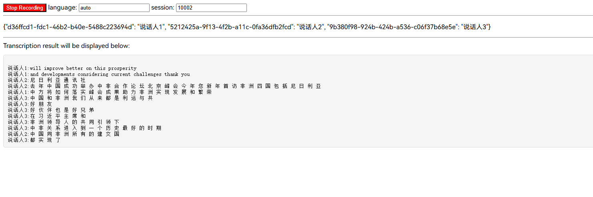
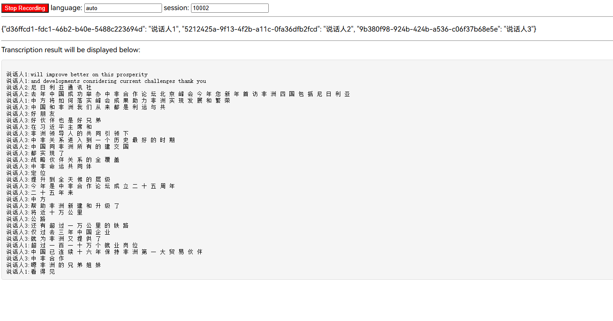

# 一个会议记录程序demo
## 由来：
本项目由[api4sensevoice](https://github.com/0x5446/api4sensevoice)项目修改而来,
因为采用websocket流式收集音频的同时采用 fsmn-vad（语音端点检测模型）进行分段收集语音 模型无法区分具体的说人
## 解决方法：
在fsmn-vad后的语音片段按照会话id进行存储 然后使用 3d speaker 来进行说话人标记

## 版本：
```shell
conda 24.11.3
python 3.10
torch 2.6.0+cu124
torchaudio 2.6.0
modelscope 1.17.1
funasr 1.2.6
```
## 安装运行：
```shell
# https://download.pytorch.org/whl/torch/ 这里下载对应版本的2.6.0的torch 
# 比如 2.6.0+cu124(gpu) 或者 2.6.0+cpu(cpu) 
# 然后使用 pip install 文件地址 安装
# 在运行下面的命令安装其他依赖
pip install -r requirements.txt
# 第一次运行会下载模型
python meeting_demo.py 
浏览器运行 meeting_demo.html
```
## 相关说明：
若需严格区分说话人（如敏感会议、多人发言需精准标记）： 选择高阈值（如 0.4），优先避免误判不同人。
若需容忍一定误差以提高匹配率（如非敏感会议、优先保证发言连续性）： 选择低阈值（如 0.25），减少同一人被拆分为多个说话人的情况。
## 预览:


## 依赖
- [https://github.com/0x5446/api4sensevoice](https://github.com/0x5446/api4sensevoice)
- [https://github.com/FunAudioLLM/SenseVoice](https://github.com/FunAudioLLM/SenseVoice)
- [https://modelscope.cn/models/iic/speech_campplus_sv_zh_en_16k-common_advanced](https://modelscope.cn/models/iic/speech_campplus_sv_zh_en_16k-common_advanced)
- [https://modelscope.cn/models/iic/speech_fsmn_vad_zh-cn-16k-common-pytorch](https://modelscope.cn/models/iic/speech_fsmn_vad_zh-cn-16k-common-pytorch)